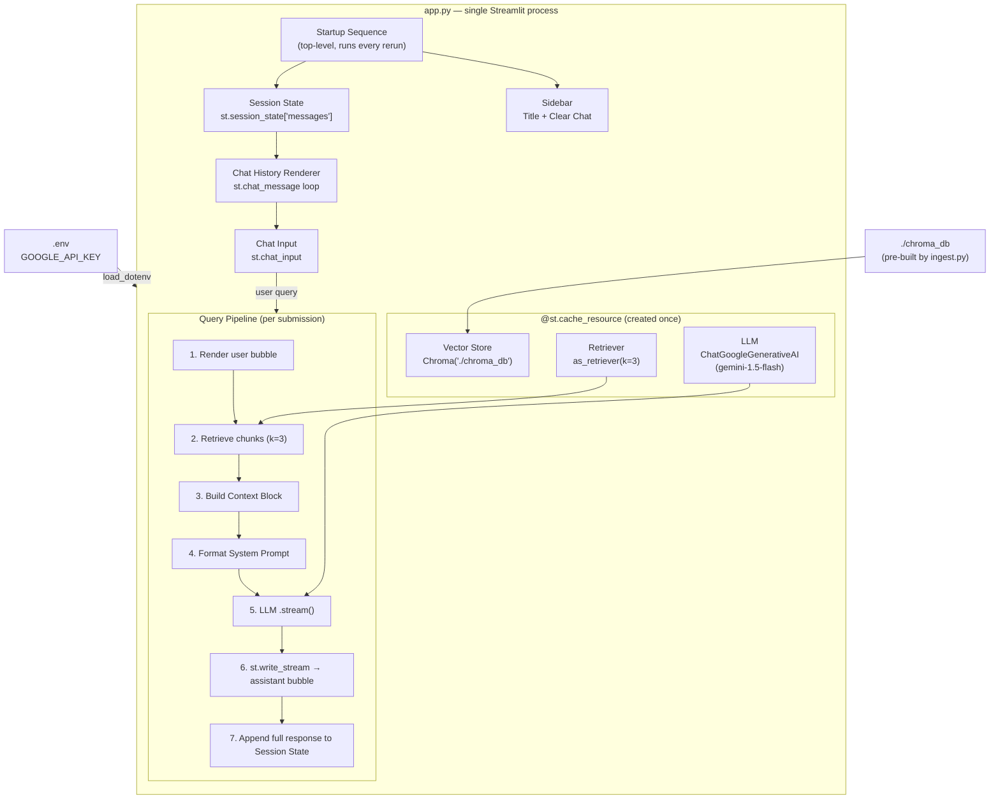
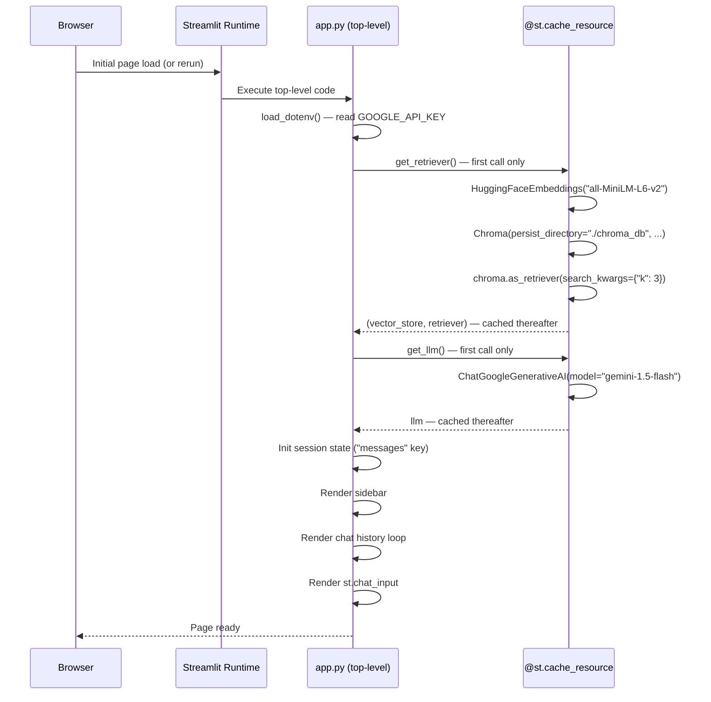
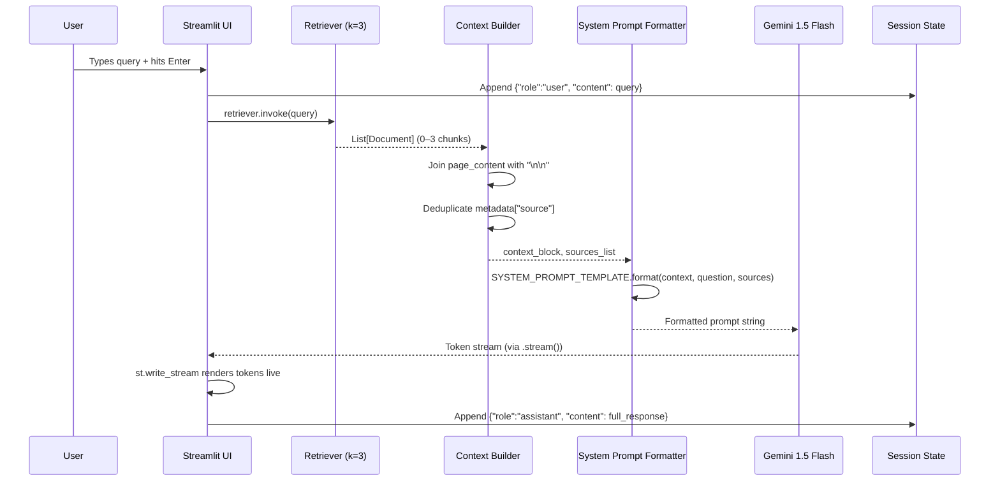

# Design Document: rag-chat-gui

## Overview

`app.py` is a single-file Streamlit application that exposes the KTlite RAG pipeline as a conversational chat GUI. On startup it loads a pre-built ChromaDB vector store and a Gemini 1.5 Flash LLM once (via `@st.cache_resource`), then on every user query it retrieves the top-3 relevant chunks, injects them into a fixed system prompt, and streams the LLM response token-by-token into the chat window.

The app deliberately owns no ingestion logic — it is a pure read-and-query consumer of the artefacts produced by `ingest.py`. All heavy objects (embeddings model, Chroma client, LangChain retriever, LLM) are created once per server process and cached, so reruns caused by Streamlit's reactive model never re-initialise them.

---

## Architecture



---

## Startup Sequence

The following steps execute in order every time Streamlit reruns `app.py`. Steps 1–3 are fast because `@st.cache_resource` functions return their cached results on subsequent calls.



---

## Components and Interfaces

### 1. Session State Initialisation

**Responsibility**: Guarantee that `st.session_state["messages"]` always exists as a list before any UI component accesses it.

```python
def init_session_state() -> None:
    """Idempotent — safe to call on every rerun."""
    if "messages" not in st.session_state:
        st.session_state["messages"] = []
```

**Invariant enforced**: After `init_session_state()` returns, `st.session_state["messages"]` is a `list` (possibly empty). Every subsequent read of the key is unconditionally safe.

**When called**: Immediately after `load_dotenv()`, before any cached resource functions or UI rendering.

---

### 2. Cached Resource Loading

Both functions are decorated with `@st.cache_resource`. Streamlit guarantees they are executed at most once per server process lifetime; all reruns receive the cached return value.

#### `get_retriever() -> tuple[Chroma, VectorStoreRetriever]`

```python
@st.cache_resource
def get_retriever():
    embeddings = HuggingFaceEmbeddings(model_name="all-MiniLM-L6-v2")
    vector_store = Chroma(
        persist_directory="./chroma_db",
        embedding_function=embeddings,
    )
    retriever = vector_store.as_retriever(search_kwargs={"k": 3})
    return vector_store, retriever
```

**Error path**: Wrapped in a `try/except` at the call site. On `Exception`, calls `st.error(...)` then `st.stop()`.

#### `get_llm() -> ChatGoogleGenerativeAI`

```python
@st.cache_resource
def get_llm():
    return ChatGoogleGenerativeAI(model="gemini-1.5-flash")
```

**Error path**: Guarded by a pre-check for `GOOGLE_API_KEY` before the function is called. If the key is absent, `st.error(...)` + `st.stop()` are called instead.

---

### 3. Sidebar

```python
def render_sidebar() -> None:
    with st.sidebar:
        st.header("📚 KTlite — RAG Chat")
        if st.button("Clear Chat"):
            st.session_state["messages"] = []
```

The Clear Chat button resets the message list in-place; Streamlit's reactive model triggers an immediate rerun that re-renders an empty chat window.

---

### 4. Chat History Renderer

```python
def render_chat_history() -> None:
    for msg in st.session_state["messages"]:
        role = msg.get("role")
        content = msg.get("content")
        if role in ("user", "assistant") and content:
            with st.chat_message(role):
                st.markdown(content)
        # Malformed entries are silently skipped
```

Iterates the message list and renders each valid entry. Entries missing `"role"`, containing an invalid role value, or with a falsy `"content"` are skipped without raising.

---

### 5. Query Pipeline

Triggered when `st.chat_input` returns a non-empty string.

```python
def handle_query(query: str, retriever, llm) -> None:
    # Step 1 — Render and persist user message
    with st.chat_message("user"):
        st.markdown(query)
    st.session_state["messages"].append({"role": "user", "content": query})

    # Step 2 — Retrieve chunks
    docs = retriever.invoke(query)          # returns List[Document], len ∈ {0..3}

    # Step 3 — Build Context Block and deduplicate sources
    if docs:
        context = "\n\n".join(doc.page_content for doc in docs)
        sources = list(dict.fromkeys(
            doc.metadata.get("source", "Unknown") for doc in docs
        ))
    else:
        context = ""
        sources = ["Unknown"]

    # Step 4 — Format System Prompt
    prompt = SYSTEM_PROMPT_TEMPLATE.format(
        context=context,
        question=query,
        sources="\n".join(f"- {s}" for s in sources),
    )

    # Step 5-6 — Stream LLM response
    with st.chat_message("assistant"):
        try:
            full_response = st.write_stream(llm.stream(prompt))
        except Exception as exc:
            st.error(f"LLM error: {exc}")
            return   # do NOT append to session state

    # Step 7 — Persist assistant response
    st.session_state["messages"].append(
        {"role": "assistant", "content": full_response}
    )
```

---

## Data Flow



---

## System Prompt Template

```python
SYSTEM_PROMPT_TEMPLATE = """\
You are a helpful assistant. Answer the user's question using ONLY the \
information provided in the context below. Do not infer, guess, or use \
knowledge outside of this context.

If the context does not contain enough information to answer the question, \
respond with exactly:
"I do not have enough information to answer that based on the provided documents."
and do NOT include a Sources section.

Context:
{context}

Question:
{question}

When you provide a substantive answer, end your response with:
Sources:
{sources}
"""
```

**Design decisions**:
- Exactly two semantic placeholders (`{context}`, `{question}`) plus `{sources}` pre-filled by the app before the string reaches the LLM — no LangChain prompt template chain is needed, keeping the data flow simple and explicit.
- The fallback phrase is specified verbatim in the prompt so the LLM's output is deterministic enough for downstream display logic.
- `{sources}` is formatted as a markdown list by the app, so the LLM only needs to emit it as-is without further formatting decisions.

---

## Key Implementation Decisions

### `@st.cache_resource` for Heavy Objects

`HuggingFaceEmbeddings` loads a ~90 MB sentence-transformer model from disk on first call. Without caching, every Streamlit rerun (including each keypress in `st.chat_input`) would reload it. `@st.cache_resource` stores the object in the server process's memory across all sessions and reruns, so the cost is paid exactly once.

### `.stream()` + `st.write_stream` for Streaming

`ChatGoogleGenerativeAI.stream(prompt)` returns a generator of token strings. `st.write_stream` consumes the generator, renders each token into the current `st.chat_message` block as it arrives, and returns the concatenated full string. This gives users immediate visual feedback and makes the app feel responsive even for long answers.

### Single-File Architecture

All components (session state, cached loaders, sidebar, history renderer, query pipeline) live in `app.py`. There are no helper modules. This matches the project's current structure (`ingest.py` is also a single file) and keeps the deployment surface minimal — `streamlit run app.py` is the only command needed.

### `dict.fromkeys()` for Source Deduplication

`dict.fromkeys(iterable)` preserves insertion order while deduplicating, which is preferable to `list(set(...))` whose output order is non-deterministic. Source filenames are shown to the user, so stable ordering matters.

---

## Data Models

### Message

Each entry stored in `st.session_state["messages"]` conforms to this shape:

```python
class Message(TypedDict):
    role: Literal["user", "assistant"]
    content: str   # non-empty, max 32 000 characters
```

### RetrievedChunk (LangChain `Document`)

The fields consumed by the query pipeline from each retrieved `Document`:

```python
class RetrievedChunk(TypedDict):
    page_content: str           # chunk text; never empty for a valid document
    metadata: dict              # must contain "source": str; falls back to "Unknown"
```

### FormattedPrompt

The string passed directly to `llm.stream()` — produced by `SYSTEM_PROMPT_TEMPLATE.format(...)`:

```python
class FormattedPrompt(TypedDict):
    context: str    # "\n\n"-joined page_content of retrieved chunks (may be "")
    question: str   # raw user query string
    sources: str    # markdown list of deduplicated source filenames
```

---

## Error Handling

| Component | Failure Condition | Handling |
|---|---|---|
| `load_dotenv` | `.env` file missing or unreadable | `load_dotenv` silently no-ops; missing key detected by subsequent `os.getenv` check |
| `GOOGLE_API_KEY` absent | Key not in environment after `load_dotenv` | `st.error("GOOGLE_API_KEY not set …")` → `st.stop()` |
| `get_retriever()` | `./chroma_db` missing, corrupt, or permission error | `st.error(str(exc))` → `st.stop()` |
| `get_llm()` | Invalid API key or network error at init | Surfaces on first `.stream()` call; caught in query pipeline |
| `retriever.invoke()` | Zero results | `context = ""`, `sources = ["Unknown"]`; LLM receives empty context and returns fallback phrase |
| `llm.stream()` | Network error, quota exceeded, timeout | `st.error(f"LLM error: {exc}")` inside assistant block; no session state append |
| `session_state["messages"]` | Malformed entry (missing key or invalid role) | Skipped silently in `render_chat_history`; never persisted by `handle_query` |

`st.stop()` is reserved exclusively for startup failures that make the app non-functional. Runtime errors (retrieval, LLM) are displayed inline and allow the session to continue.

---

## Correctness Properties

These properties are invariants that must hold throughout any valid execution of the app. They inform both manual review and property-based tests.

### Property 1: Session state key always present after init

**Validates: Requirements 1.1, 1.2**

```python
# After init_session_state() returns, the key is guaranteed to exist.
assert "messages" in st.session_state
```

### Property 2: Messages list contains only well-formed entries

**Validates: Requirements 1.3, 1.4**

```python
# Every entry persisted to session state has a valid role and non-empty content.
for msg in st.session_state["messages"]:
    assert isinstance(msg, dict)
    assert msg.get("role") in ("user", "assistant")
    assert isinstance(msg.get("content"), str) and len(msg["content"]) > 0
```

### Property 3: Roles alternate strictly

**Validates: Requirements 1.3, 7.2, 7.6**

```python
# Conversation turns alternate: user → assistant → user → …
roles = [m["role"] for m in st.session_state["messages"]]
for i in range(1, len(roles)):
    assert roles[i] != roles[i - 1]
```

### Property 4: Content length is bounded

**Validates: Requirements 1.3**

```python
for msg in st.session_state["messages"]:
    assert len(msg["content"]) <= 32_000
```

### Property 5: Retriever returns at most k=3 documents

**Validates: Requirements 2.2, 7.3**

```python
docs = retriever.invoke(any_query)
assert len(docs) <= 3
```

### Property 6: All retrieved documents have page_content

**Validates: Requirements 7.4**

```python
for doc in docs:
    assert isinstance(doc.page_content, str)
```

### Property 7: Sources list is never empty

**Validates: Requirements 5.1, 7.3**

```python
# Even when retriever returns zero chunks, sources falls back to ["Unknown"].
sources = build_sources(docs)
assert len(sources) >= 1
```

### Property 8: Sources list contains no duplicates

**Validates: Requirements 5.2, 7.4**

```python
assert len(sources) == len(set(sources))
```

### Property 9: Every source is a non-empty string

**Validates: Requirements 5.1, 5.3**

```python
for s in sources:
    assert isinstance(s, str) and len(s) > 0
```

### Property 10: Missing metadata source maps to "Unknown"

**Validates: Requirements 4.4, 5.1**

```python
for doc in docs:
    source = doc.metadata.get("source", "Unknown")
    assert source != "" and source is not None
```

### Property 11: System prompt template always contains required placeholders

**Validates: Requirements 4.3**

```python
assert "{context}" in SYSTEM_PROMPT_TEMPLATE
assert "{question}" in SYSTEM_PROMPT_TEMPLATE
assert "{sources}" in SYSTEM_PROMPT_TEMPLATE
```

### Property 12: Formatted prompt is a non-empty string

**Validates: Requirements 4.1, 4.3**

```python
prompt = SYSTEM_PROMPT_TEMPLATE.format(context="ctx", question="q", sources="- f.txt")
assert isinstance(prompt, str) and len(prompt) > 0
```

### Property 13: Streaming response is the concatenation of all tokens

**Validates: Requirements 7.5, 7.6**

```python
# full_response equals the join of every token emitted by the stream.
tokens = list(llm.stream(prompt))
full_response = "".join(t.content for t in tokens)
assert len(full_response) >= 0   # may be empty string on fallback response
```

### Property 14: Session state append only occurs on successful stream

**Validates: Requirements 7.6, 7.7**

```python
# The append line is only reachable when st.write_stream returns without raising.
# Verified structurally: the except block returns early, bypassing the append.
# No malformed entry is ever written to session state on LLM failure.
```

---

## Testing Strategy

### Unit Tests

Each pure function is independently testable without Streamlit:

| Function | Test Approach |
|---|---|
| `init_session_state()` | Mock `st.session_state` as a plain dict; assert key added on first call, not duplicated on second |
| `build_context_block(docs)` | Pass list of `Document` stubs; assert `"\n\n"` separator and correct join |
| `build_sources(docs)` | Parametrize: all with source, some missing, all missing, duplicates; assert deduplication and "Unknown" fallback |
| `SYSTEM_PROMPT_TEMPLATE.format(...)` | Assert all placeholders resolve; assert no `KeyError` |

### Property-Based Tests (Hypothesis)

```python
from hypothesis import given, strategies as st

@given(st.lists(
    st.fixed_dictionaries({
        "page_content": st.text(min_size=1),
        "metadata": st.one_of(
            st.fixed_dictionaries({"source": st.text(min_size=1)}),
            st.fixed_dictionaries({})          # missing source
        )
    }),
    max_size=3
))
def test_build_sources_never_empty(docs):
    # Wrap raw dicts as Document-like objects
    sources = build_sources(docs)
    assert len(sources) >= 1                   # P7
    assert len(sources) == len(set(sources))   # P8
    for s in sources:
        assert isinstance(s, str) and s        # P9

@given(st.lists(
    st.fixed_dictionaries({
        "role": st.sampled_from(["user", "assistant"]),
        "content": st.text(min_size=1, max_size=32_000)
    }),
    max_size=50
))
def test_render_history_skips_malformed(messages):
    # Inject some malformed entries and assert no exception is raised
    malformed = [{"role": "bot", "content": "x"}, {"role": "user"}, {}]
    combined = messages + malformed
    # render_chat_history should complete without raising
    render_chat_history_pure(combined)   # testable pure variant
```

### Integration / Smoke Test

Run `streamlit run app.py --server.headless true` and confirm:
1. Process starts without error when `.env` and `./chroma_db` are present.
2. A `curl` to `http://localhost:8501` returns HTTP 200.
3. Process exits cleanly when the environment variable is removed (expects `st.stop()`).

---

## Dependencies

| Package | Role |
|---|---|
| `streamlit` | Web UI framework, session state, chat components |
| `langchain-chroma` | `Chroma` vector store wrapper |
| `langchain-huggingface` | `HuggingFaceEmbeddings` |
| `langchain-google-genai` | `ChatGoogleGenerativeAI` |
| `python-dotenv` | `load_dotenv()` to read `.env` |
| `sentence-transformers` | Underlying model for `all-MiniLM-L6-v2` (transitive via langchain-huggingface) |

All packages are already present in the project environment (used by `ingest.py` or declared as Chat GUI requirements). No new dependencies are introduced.
