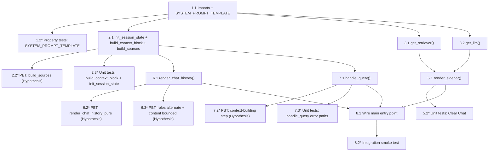

# Implementation Plan: rag-chat-gui

## Overview

Implement `app.py` as a single-file Streamlit RAG chat application that connects to the existing ChromaDB vector store, retrieves relevant chunks, and streams answers from Gemini 1.5 Flash. The implementation follows the design document exactly — no ingestion logic, no helper modules, only pure read-and-query behaviour.

---

## Tasks

- [x] 1. Scaffold `app.py` — imports, constants, and type stubs
  - [x] 1.1 Write the file header, all top-level imports, and `SYSTEM_PROMPT_TEMPLATE`
    - Create `app.py` at the project root with the following import block:
      `streamlit`, `os`, `load_dotenv` (python-dotenv), `Chroma` (langchain-chroma),
      `HuggingFaceEmbeddings` (langchain-huggingface),
      `ChatGoogleGenerativeAI` (langchain-google-genai), `TypedDict`, `Literal`, `List`
    - Define the `Message` TypedDict and `RetrievedChunk` TypedDict as described in the design Data Models section
    - Define `SYSTEM_PROMPT_TEMPLATE` as the verbatim multi-line string from the design (with `{context}`, `{question}`, and `{sources}` placeholders)
    - _Requirements: 4.3_

  - [x] 1.2 Write property tests for `SYSTEM_PROMPT_TEMPLATE`
    - **Property 11: System prompt template always contains required placeholders** — assert `{context}`, `{question}`, `{sources}` are all present in the template string
    - **Property 12: Formatted prompt is a non-empty string** — call `.format(context="ctx", question="q", sources="- f.txt")` and assert result is a non-empty `str`
    - **Validates: Requirements 4.3, 4.1**
    - Use `pytest` (no Hypothesis needed; these are pure structural assertions)
    - Place tests in `tests/test_app.py`

- [x] 2. Implement session-state initialisation and pure helper functions
  - [x] 2.1 Implement `init_session_state()` and the two pure helper functions `build_context_block` and `build_sources`
    - Write `init_session_state() -> None` exactly as shown in the design Components section; it must be idempotent (safe to call on every rerun)
    - Write `build_context_block(docs: list) -> str` that joins `doc.page_content` with `"\n\n"` for a non-empty list and returns `""` for an empty list
    - Write `build_sources(docs: list) -> list[str]` that extracts `doc.metadata.get("source", "Unknown")` from each doc, deduplicates using `dict.fromkeys` (preserves order), and returns `["Unknown"]` for an empty input
    - These three functions must not import or reference Streamlit at runtime so they can be unit-tested in isolation
    - _Requirements: 1.1, 1.2, 5.1, 5.2, 7.3, 7.4_

  - [x] 2.2 Write property-based tests for `build_sources` using Hypothesis
    - **Property 7: Sources list is never empty** — generate lists of Document-like dicts (0–3 items, both with and without `metadata["source"]`); assert `len(sources) >= 1`
    - **Property 8: Sources list contains no duplicates** — same generation strategy; assert `len(sources) == len(set(sources))`
    - **Property 9: Every source is a non-empty string** — assert `isinstance(s, str) and s` for every `s` in `sources`
    - **Property 10: Missing metadata source maps to "Unknown"** — generate docs with empty metadata dicts; assert `"Unknown"` appears and no empty string is ever returned
    - **Validates: Requirements 5.1, 5.2, 4.4**
    - Use the `@given` + `st.fixed_dictionaries` / `st.lists` strategy pattern shown in the design Testing Strategy section

  - [x] 2.3 Write unit tests for `build_context_block` and `init_session_state`
    - For `build_context_block`: test empty list → `""`, single doc, multiple docs joined with `"\n\n"`
    - For `init_session_state`: mock `st.session_state` as a plain `dict`; assert key added on first call; assert list is unchanged on second call
    - **Validates: Requirements 1.1, 1.2, 7.4**

- [x] 3. Implement cached resource loaders with error guards
  - [x] 3.1 Implement `get_retriever()` decorated with `@st.cache_resource`
    - Inside the function: construct `HuggingFaceEmbeddings(model_name="all-MiniLM-L6-v2")`, then `Chroma(persist_directory="./chroma_db", embedding_function=embeddings)`, then call `vector_store.as_retriever(search_kwargs={"k": 3})`; return `(vector_store, retriever)`
    - At the call site (top-level startup), wrap the call in `try/except Exception as exc`; on failure call `st.error(str(exc))` then `st.stop()`
    - _Requirements: 2.1, 2.2, 2.3, 2.4_

  - [x] 3.2 Implement `get_llm()` decorated with `@st.cache_resource`
    - Before calling `get_llm()` at the top level, read `os.getenv("GOOGLE_API_KEY")`; if absent call `st.error("GOOGLE_API_KEY not set …")` then `st.stop()`
    - Inside `get_llm()`: return `ChatGoogleGenerativeAI(model="gemini-1.5-flash")`
    - _Requirements: 3.1, 3.2, 3.3_

- [x] 4. Checkpoint — verify scaffold compiles and cached loaders are importable
  - Ensure all tests pass, ask the user if questions arise.
  - Specifically confirm: `python -c "import app"` exits 0 (Streamlit top-level code must be guarded or deferred so the import itself does not spin up the server)

- [x] 5. Implement `render_sidebar()`
  - [x] 5.1 Write `render_sidebar() -> None`
    - Use `with st.sidebar:` context; call `st.header("📚 KTlite — RAG Chat")`
    - Render `st.button("Clear Chat")`; on truthy return set `st.session_state["messages"] = []`
    - _Requirements: 6.1, 6.2, 6.3_

  - [x] 5.2 Write unit tests for sidebar Clear Chat logic
    - Mock `st.session_state` and `st.button` returning `True`; assert `st.session_state["messages"]` is reset to `[]`
    - **Validates: Requirements 6.3**

- [x] 6. Implement `render_chat_history()`
  - [x] 6.1 Write `render_chat_history() -> None`
    - Iterate `st.session_state["messages"]`; for each entry call `msg.get("role")` and `msg.get("content")`
    - Skip any entry whose role is not in `("user", "assistant")` or whose content is falsy
    - For valid entries: `with st.chat_message(role): st.markdown(content)`
    - Also write a testable pure variant `render_chat_history_pure(messages: list) -> list[dict]` that returns the list of valid entries (no Streamlit calls) — needed for property tests
    - _Requirements: 1.4_

  - [x] 6.2 Write property-based tests for `render_chat_history_pure` using Hypothesis
    - **Property 2: Messages list contains only well-formed entries** — generate lists mixing valid and malformed dicts; assert `render_chat_history_pure` returns only dicts with valid role and non-empty content, no exceptions raised
    - Generate malformed entries including missing keys, invalid role values like `"bot"`, empty content strings
    - **Validates: Requirements 1.4**

  - [x] 6.3 Write property-based tests for session-state message well-formedness using Hypothesis
    - **Property 3: Roles alternate strictly** — generate alternating `["user", "assistant", ...]` lists and also lists with consecutive same roles; assert the alternating lists pass role-pair validation and the non-alternating lists are detected as invalid
    - **Property 4: Content length is bounded** — generate content strings up to 32,000 characters; assert all pass the `len(content) <= 32_000` invariant; generate strings over 32,000 and assert they would be rejected
    - **Validates: Requirements 1.3**

- [x] 7. Implement `handle_query()` — the full query pipeline
  - [x] 7.1 Write `handle_query(query: str, retriever, llm) -> None`
    - Step 1 — Render user bubble: `with st.chat_message("user"): st.markdown(query)`; then `st.session_state["messages"].append({"role": "user", "content": query})`
    - Step 2 — Retrieve: `docs = retriever.invoke(query)` (returns `List[Document]`, 0–3 items)
    - Step 3 — Build context and sources: call `build_context_block(docs)` and `build_sources(docs)`
    - Step 4 — Format prompt: `prompt = SYSTEM_PROMPT_TEMPLATE.format(context=context, question=query, sources="\n".join(f"- {s}" for s in sources))`
    - Step 5-6 — Stream: inside `with st.chat_message("assistant"):`, call `full_response = st.write_stream(llm.stream(prompt))` wrapped in `try/except Exception as exc`; on exception call `st.error(f"LLM error: {exc}")` and `return` (do NOT append to session state)
    - Step 7 — Persist: `st.session_state["messages"].append({"role": "assistant", "content": full_response})`
    - _Requirements: 7.1, 7.2, 7.3, 7.4, 7.5, 7.6, 7.7_

  - [x] 7.2 Write property-based tests for the context-building step of `handle_query` using Hypothesis
    - **Property 5: Retriever returns at most k=3 documents** — generate lists of 0–3 Document stubs; assert `len(docs) <= 3` and that `build_context_block` and `build_sources` handle all list lengths without raising
    - **Property 6: All retrieved documents have page_content** — generate Document stubs with non-empty `page_content`; assert `build_context_block` output contains each chunk's content
    - **Validates: Requirements 2.2, 7.3, 7.4**

  - [x] 7.3 Write unit tests for `handle_query` error paths
    - Mock `retriever.invoke` to return zero docs; assert `build_sources` returns `["Unknown"]` and `build_context_block` returns `""`
    - Mock `llm.stream` to raise an exception; assert `st.error` is called and no assistant entry is appended to session state
    - **Property 14: Session state append only occurs on successful stream** — verified structurally; assert the message list length does not grow on LLM failure
    - **Validates: Requirements 7.3, 7.7**

- [x] 8. Wire the main entry point
  - [x] 8.1 Write the top-level execution block in `app.py`
    - Call `load_dotenv()` first
    - Check `os.getenv("GOOGLE_API_KEY")`; if missing → `st.error(...)` + `st.stop()`
    - Call `get_retriever()` inside `try/except`; on failure → `st.error(str(exc))` + `st.stop()`; unpack `(vector_store, retriever)`
    - Call `get_llm()` to obtain `llm`
    - Call `init_session_state()`
    - Call `render_sidebar()`
    - Call `render_chat_history()`
    - Render `st.chat_input("Ask a question about your documents...")`; if it returns a non-empty string, call `handle_query(query, retriever, llm)`
    - _Requirements: 1.1, 2.4, 3.1, 3.3, 6.1, 7.1_

  - [x] 8.2 Write integration smoke test for the startup sequence
    - **Property 1: Session state key always present after init** — call `init_session_state()` with a mock session state dict; assert `"messages"` key exists and is a list
    - Assert that the startup sequence (mocked Streamlit components) calls `st.stop()` when `GOOGLE_API_KEY` is absent
    - Assert that the startup sequence calls `st.stop()` when `get_retriever()` raises
    - **Validates: Requirements 1.1, 1.2, 2.4, 3.3**

- [x] 9. Final checkpoint — ensure all tests pass
  - Ensure all tests pass, ask the user if questions arise.
  - Run `pytest tests/test_app.py -v` and confirm all unit and property-based tests pass
  - Verify `app.py` is fully wired end-to-end per the design architecture diagram

---

## Notes

- Tasks marked with `*` are optional and can be skipped for a faster MVP
- All property-based tests use [Hypothesis](https://hypothesis.readthedocs.io/) (`from hypothesis import given, strategies as st`)
- Unit tests use `pytest` with `unittest.mock` for Streamlit component mocking
- Place all tests in `tests/test_app.py`; no other test files are needed
- `build_context_block` and `build_sources` are extracted as pure functions specifically to make them testable without Streamlit; `handle_query` delegates to them
- `render_chat_history_pure` is a testable variant of `render_chat_history` with identical logic but no `st.*` calls
- The `@st.cache_resource` functions are tested only at the call-site level (error guards); their internals depend on live ChromaDB and Gemini API, which are out of scope for automated tests
- Each task references specific requirements for traceability
- Checkpoints ensure incremental validation

---

## Task Dependency Graph



```json
{
  "waves": [
    { "id": 0, "tasks": ["1.1"] },
    { "id": 1, "tasks": ["1.2", "2.1", "3.1", "3.2"] },
    { "id": 2, "tasks": ["2.2", "2.3", "5.1", "6.1", "7.1"] },
    { "id": 3, "tasks": ["5.2", "6.2", "6.3", "7.2", "7.3", "8.1"] },
    { "id": 4, "tasks": ["8.2"] }
  ]
}
```
