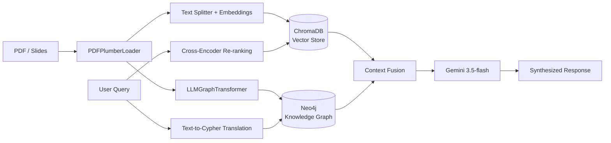

<div align="center">

# KTlite

### Hybrid GraphRAG — Where Vector Search Meets Knowledge Graph Reasoning

*A local-first Retrieval-Augmented Generation system that fuses semantic vector search with multi-hop logical reasoning over knowledge graphs.*

[](https://www.python.org/)
[](https://www.langchain.com/)
[](https://neo4j.com/)
[](https://www.trychroma.com/)
[](https://streamlit.io/)
[](#license)

</div>

---

## Table of Contents

- [KTlite](#ktlite)
    - [Hybrid GraphRAG — Where Vector Search Meets Knowledge Graph Reasoning](#hybrid-graphrag--where-vector-search-meets-knowledge-graph-reasoning)
  - [Table of Contents](#table-of-contents)
  - [Overview](#overview)
  - [The Problem It Solves](#the-problem-it-solves)
  - [Core Features](#core-features)
  - [Technology Stack](#technology-stack)
  - [Architecture](#architecture)
    - [Ingestion Phase — `ingest.py`](#ingestion-phase--ingestpy)
    - [Retrieval Phase — `app.py`](#retrieval-phase--apppy)
  - [Getting Started](#getting-started)
    - [1. Prerequisites](#1-prerequisites)
    - [2. Environment Setup](#2-environment-setup)
    - [3. Start the Graph Database](#3-start-the-graph-database)
    - [4. Ingest Your Data](#4-ingest-your-data)
    - [5. Launch the Application](#5-launch-the-application)
  - [Usage](#usage)
  - [Roadmap](#roadmap)
  - [License](#license)

---

## Overview

**KTlite** is an advanced, local-first Retrieval-Augmented Generation (RAG) system built on a **hybrid architecture** that intelligently combines semantic vector search with the multi-hop logical reasoning of knowledge graphs. By understanding not just *what* your documents say, but *how the concepts within them connect*, KTlite eliminates the hallucinations and context loss typical of standard RAG applications.

---

## The Problem It Solves

Traditional RAG systems rely solely on vector databases (like ChromaDB). While excellent for fuzzy semantic matching, they treat documents as fragmented chunks of text — so when a question requires traversing multiple logical steps across different pages, standard RAG falls short.

KTlite addresses this gap with a **Hybrid GraphRAG Architecture**. It extracts the mathematical topology of your documents — mapping entities and their relationships — and stores them in Neo4j. At query time, KTlite traverses these structural edges to synthesize complex technical material, such as computer science lecture slides on network flow algorithms, C++ data structures, or intricate database schemas.

---

## Core Features

| Feature | Description |
|---|---|
| **Dual-Pipeline Ingestion** | Automatically processes PDFs and slides, simultaneously chunking text for semantic search and extracting entity-relationship graphs for logical reasoning. |
| **Idempotent State Management** | Powered by LangChain's `SQLRecordManager`, the ingestion engine tracks document hashes — only processing new or modified files, and cleanly pruning deleted data without redundant API calls. |
| **Two-Stage Vector Retrieval** | Utilizes a `ContextualCompressionRetriever` with a HuggingFace Cross-Encoder (`ms-marco-MiniLM-L-6-v2`) to re-rank vector search results for maximum semantic relevance. |
| **Dynamic Graph Traversal** | A Cypher QA Chain translates natural language queries into real-time database queries, navigating the Neo4j knowledge graph to fetch precise, structural context. |
| **Optimized LLM Routing** | Built primarily on Google's `gemini-3.5-flash` for heavy extraction and reasoning, with scalable prompt mechanics to manage rate limits efficiently. |

---

## Technology Stack

| Component | Technology Used | Purpose |
|---|---|---|
| **Frontend UI** | Streamlit | Lightweight, interactive chat interface |
| **Orchestration** | LangChain | Core framework for chaining LLMs, retrievers, and databases |
| **Vector Store** | ChromaDB | Local storage for dense vector embeddings (`all-MiniLM-L6-v2`) |
| **Graph Database** | Neo4j (Docker) | Visual, persistent storage for extracted knowledge topologies |
| **Re-ranking** | HuggingFace Cross-Encoders | Algorithmic re-ranking of retrieved context chunks |
| **Core LLM** | Google Gemini (`3.5-flash`) | Text generation, JSON graph extraction, and Cypher translation |

---

## Architecture

### Ingestion Phase — `ingest.py`

1. Documents are loaded via `PDFPlumberLoader` to preserve spatial layouts.
2. **Path A — Vector:** Text is split, hashed, embedded, and synced to ChromaDB.
3. **Path B — Graph:** Full pages are passed to `LLMGraphTransformer` to extract JSON node/edge pairs, which are then pushed to Neo4j.

### Retrieval Phase — `app.py`

1. The user submits a natural language query via Streamlit.
2. The system executes a text-to-Cypher translation to retrieve the exact structural subgraph from Neo4j.
3. The system simultaneously retrieves semantically similar chunks from ChromaDB and fuses them directly with the graph topology into a unified LLM prompt.
4. The LLM synthesizes the combined context and streams the final, highly accurate response to the user.



---

## Getting Started

### 1. Prerequisites

- Python 3.10+
- Docker Desktop (for Neo4j)
- A Google Gemini API Key

### 2. Environment Setup

Clone the repository and install dependencies:

```bash
git clone https://github.com/yourusername/KTlite.git
cd KTlite
python -m venv venv
source venv/bin/activate  # Or .\venv\Scripts\Activate.ps1 on Windows
pip install -r requirements.txt
```

Create a `.env` file in the root directory:

```env
GOOGLE_API_KEY="your_gemini_api_key_here"
```

### 3. Start the Graph Database

Spin up the local Neo4j container with the required APOC plugins enabled:

```bash
docker run --name neo4j -p 7474:7474 -p 7687:7687 -d \
  -e NEO4J_AUTH=neo4j/password \
  -e 'NEO4J_PLUGINS=["apoc"]' \
  neo4j:latest
```

### 4. Ingest Your Data

Place your PDF files into the `./data` directory and run the ingestion pipeline.

> **Note:** Be mindful of Gemini API rate limits for large document batches.

```bash
python ingest.py
```

### 5. Launch the Application

```bash
streamlit run app.py
```

Navigate to **[http://localhost:8501](http://localhost:8501)** in your browser to begin querying your data.

---

## Usage

Once running, simply type a natural language question into the Streamlit chat interface. KTlite will:

1. Translate your question into a Cypher query to traverse relevant entities in Neo4j.
2. Retrieve and re-rank supporting context from ChromaDB.
3. Fuse both sources and stream a synthesized, source-grounded answer.

---

## Roadmap

- [ ] Support for additional document formats (DOCX, HTML)
- [ ] Configurable LLM backend (swap Gemini for local models)
- [ ] Evaluation suite for retrieval accuracy benchmarking

---

## License

This project is licensed under the **MIT License**.

<div align="center">

---

Made for smarter document understanding

</div>
